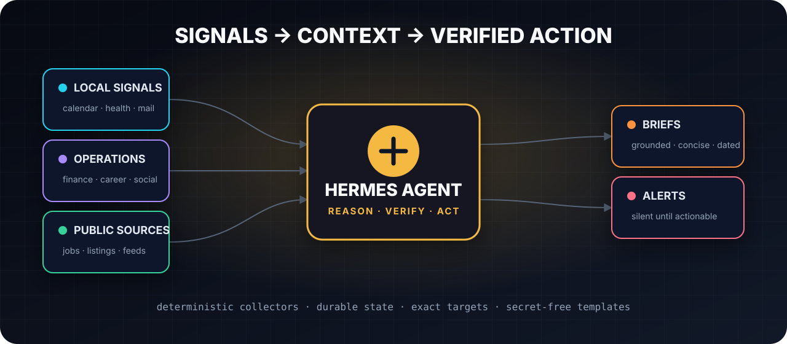
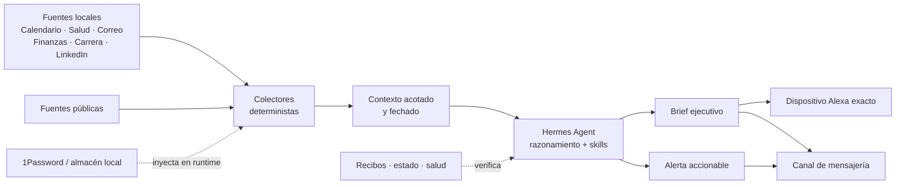

<div align="center">



# Hermes Automation Stack

**Patrones de producción para convertir Hermes Agent en una capa confiable de operaciones personales.**

Colectores deterministas, briefs ejecutivos verificables, watchdogs silenciosos, entrega exacta por Alexa, flujos laborales y skills reutilizables — publicados sin secretos ni datos personales.

[](https://github.com/Chere3/hermes-automation-stack/actions/workflows/ci.yml)
[](LICENSE)
[](https://www.python.org/)
[](https://github.com/NousResearch/hermes-agent)

[English](README.md) · [Inicio rápido](#inicio-rápido) · [Contenido](#qué-incluye) · [Arquitectura](#arquitectura) · [Seguridad](#seguridad-por-diseño) · [Contribuir](CONTRIBUTING.md)

</div>

## Por qué existe

Un agente personal es fácil de demostrar y difícil de operar bien. Debe recopilar hechos sin inventar, permanecer en silencio cuando nada cambió, sobrevivir sesiones caducadas y fallos parciales, evitar efectos duplicados, entregar al dispositivo o conversación exactos y mantener el estado privado fuera de Git.

Este repositorio captura los patrones que volvieron confiables esos flujos en un despliegue real de Hermes. **No es una copia de `~/.hermes`** ni un instalador de un clic: es un punto de partida portable y auditable con código, contratos de prompts, horarios, pruebas y skills, pero sin credenciales, transcripciones ni bases personales.

## Qué incluye

| Área | Contenido |
|---|---|
| **Briefs ejecutivos** | Contratos matutinos, nocturnos y para WhatsApp basados en fuentes fechadas. |
| **Colectores deterministas** | Contexto de calendario, salud/Fitbit, correo, finanzas, LinkedIn, empleo y fuentes públicas. |
| **Watchdogs silenciosos** | Sin salida en éxito o ausencia de cambios; alertas sólo ante transiciones o fallos accionables. |
| **Seguridad Alexa** | Preflight de autenticación de sólo lectura, destino exacto y recibos durables. |
| **Operaciones laborales** | Separación explícita entre descubrir/preparar y enviar formularios sensibles. |
| **Skills reutilizables** | Briefs, OAuth, secretos, computer use, autoalojamiento, Android y liveness de agentes. |
| **Plantillas públicas** | Variables, configuración Hermes y cron sin valores específicos del despliegue. |

## Inicio rápido

Requiere [Hermes Agent](https://github.com/NousResearch/hermes-agent), Python 3.11+ y, opcionalmente, [uv](https://docs.astral.sh/uv/).

```bash
git clone https://github.com/Chere3/hermes-automation-stack.git
cd hermes-automation-stack
uv venv --python 3.11
uv pip install --python .venv/bin/python -r requirements.txt
cp .env.example .env
```

Copia únicamente los módulos que vayas a usar:

```bash
export HERMES_HOME="${HERMES_HOME:-$HOME/.hermes}"
install -d "$HERMES_HOME/scripts" "$HERMES_HOME/skills"
cp scripts/*.py "$HERMES_HOME/scripts/"
cp -R skills/* "$HERMES_HOME/skills/"
```

Después sustituye los placeholders de tu `.env`, aplica cada ajuste con `hermes config set`, recrea sólo los jobs necesarios desde `cron/jobs.example.yaml` y prueba cada colector manualmente antes de programarlo. El YAML de cron es una referencia legible, no un archivo importable.

## Arquitectura



- Los scripts recopilan y normalizan hechos; no redactan la narrativa.
- Hermes razona sobre evidencia acotada y distingue planes de acciones completadas.
- Los watchdogs observan progreso durable, no sólo procesos vivos.
- Los efectos se limitan a un destino exacto y se verifican después.

## Estructura

```text
scripts/                  colectores, watchdogs y pruebas
skills/                   skills Hermes y referencias reutilizables
prompts/                  contratos de generación de briefs
cron/jobs.example.yaml    referencia de horarios sanitizada
config/                   configuración pública de ejemplo
docs/security.md          frontera de datos y secretos
.github/                  CI y plantillas de colaboración
```

## Patrones principales

### Briefs basados en evidencia

Cada brief sigue el flujo colector → contexto → razonamiento → entrega. Los registros durables y las fuentes prueban lo ocurrido; el historial de conversación sólo aporta contexto complementario.

### Monitores silenciosos

Una ejecución sana produce stdout vacío. Los fallos persistentes se cuentan y se elevan tras un umbral; una descarga fallida nunca sustituye una línea base válida.

### Límites humanos

Los flujos laborales y de navegador se detienen ante CAPTCHA, MFA, campos ambiguos, posibles duplicados o elegibilidad incierta. Preparar puede ser autónomo; enviar requiere una autorización separada y evidencia.

## Seguridad por diseño

El repositorio no contiene:

- claves, tokens OAuth, cookies, contraseñas ni valores de 1Password;
- sesiones, memorias, identificadores de canales, pairing, logs o perfiles del navegador;
- datos reales de calendario, salud, correo, finanzas o carrera;
- automatización privada de compras ni su estado;
- `config.yaml`, bases de cron o historial de ejecuciones reales.

El árbol público inicial pasó `detect-secrets` sin hallazgos. CI compila el Python y ejecuta las pruebas deterministas. Revisa [docs/security.md](docs/security.md) y [SECURITY.md](SECURITY.md).

## Pruebas

```bash
python -m compileall -q scripts skills
PYTHONPATH=scripts python -m unittest discover -s scripts/tests -p 'test_*.py' -v
```

Las pruebas cubren parsers, paginación, identidad, escritura atómica, conservación de estado, normalización del calendario, conflictos horarios y contratos de salida silenciosa. CI no ejecuta acciones reales de red o dispositivos.

## Contribuir

Son bienvenidos issues y pull requests para nuevos colectores de sólo lectura, watchdogs por transición, adaptadores de entrega, compatibilidad multiplataforma y pruebas de redacción o fallos. Antes de añadir una escritura real, abre un issue y documenta límites de autorización y verificación.

Lee [CONTRIBUTING.md](CONTRIBUTING.md). Los reportes de seguridad deben enviarse por la vía privada descrita en [SECURITY.md](SECURITY.md).

Si te sirve, una estrella ayuda a que otros usuarios de Hermes lo encuentren.

## Licencia

[MIT](LICENSE). Los servicios externos, skills adaptadas y proyectos complementarios conservan sus propias licencias y términos.
