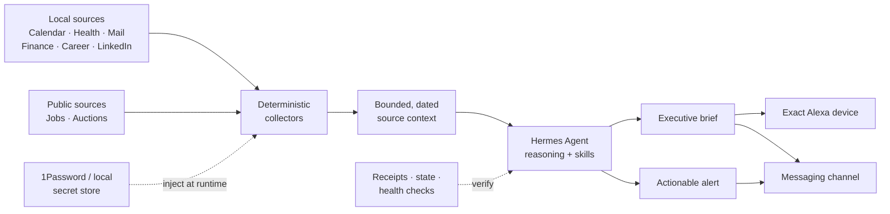

<div align="center">


# Hermes Automation Stack

**Production patterns for turning Hermes Agent into a reliable personal operations layer.**

Deterministic collectors, grounded executive briefs, silent watchdogs, exact-device Alexa delivery, career workflows, and reusable agent skills — published as a secret-free blueprint.

[](https://github.com/Chere3/hermes-automation-stack/actions/workflows/ci.yml)
[](LICENSE)
[](https://www.python.org/)
[](https://github.com/NousResearch/hermes-agent)
[](https://github.com/Chere3/hermes-automation-stack/stargazers)

[Español](README.es.md) · [Quick start](#quick-start) · [What is inside](#what-is-inside) · [Architecture](#architecture) · [Security](#security-by-design) · [Contributing](CONTRIBUTING.md)

</div>

## Why this exists

Personal agents are easy to demo and surprisingly hard to operate.

A useful deployment has to collect facts without hallucinating, stay silent when nothing changed, survive expired sessions and partial outages, avoid duplicate side effects, deliver to the exact device or conversation, and keep private state out of source control. This repository captures the patterns that made those workflows dependable in a real Hermes deployment.

It is **not a backup of `~/.hermes`** and not a one-click bundle. It is a portable, reviewable starting point: the automation code, prompt contracts, schedules, tests, and operational skills — without credentials, transcripts, personal databases, or generated records.

## What is inside

| Area | What it provides |
|---|---|
| **Executive briefs** | Morning, evening, and WhatsApp prompt contracts grounded in dated source context instead of model memory. |
| **Deterministic collectors** | Calendar, health/Fitbit, mail, finance, LinkedIn, career, job-posting, and auction context with bounded output. |
| **Quiet watchdogs** | Scripts that print nothing on healthy/no-change runs and emit only actionable failures or transitions. |
| **Alexa safety** | Read-only auth preflight, exact-device contracts, durable delivery receipts, and recovery guidance. |
| **Career operations** | A staged handoff that separates discovery and preparation from consequential form submission. |
| **Reusable skills** | Field-tested playbooks for cron briefings, OAuth, secret management, computer use, self-hosting, Android integration, and agent liveness. |
| **Public-safe templates** | Example environment, Hermes settings, and cron definitions with deployment-specific values replaced by placeholders. |

## Quick start

Requires [Hermes Agent](https://github.com/NousResearch/hermes-agent), Python 3.11+, and optionally [uv](https://docs.astral.sh/uv/).

```bash
git clone https://github.com/Chere3/hermes-automation-stack.git
cd hermes-automation-stack

uv venv --python 3.11
uv pip install --python .venv/bin/python -r requirements.txt
cp .env.example .env
```

Copy only the modules you plan to run:

```bash
export HERMES_HOME="${HERMES_HOME:-$HOME/.hermes}"
install -d "$HERMES_HOME/scripts" "$HERMES_HOME/skills"
cp scripts/*.py "$HERMES_HOME/scripts/"
cp -R skills/* "$HERMES_HOME/skills/"
```

Then:

1. Replace the placeholders in your local `.env`.
2. Review `config/hermes-config.example.yaml` and apply settings with `hermes config set` — do not overwrite the live config blindly.
3. Recreate only the schedules you need from `cron/jobs.example.yaml`; it is a readable template, not an import file.
4. Run each collector manually before scheduling it.
5. Keep `security.redact_secrets=true` and scan every public change.

Some collectors are adapters for companion services such as a health pipeline, a finance MCP server, or an Alexa bridge. Missing companions fail closed or report unavailable context; see the source constants and environment variables before enabling a job.

## Architecture



The boundary is deliberate:

- **Scripts collect and normalize facts.** They do not write the narrative.
- **Hermes reasons over bounded evidence.** Prompts prohibit invented activity and distinguish plans from completed actions.
- **Watchdogs observe durable signals.** Process-alive is not treated as workflow-healthy.
- **Side effects are narrow and verified.** Exact target resolution and read → write → read are the default for device operations.

## Repository map

```text
.
├── scripts/                 # Collectors and watchdogs
│   └── tests/               # Parser, persistence, and safety tests
├── skills/                  # Reusable Hermes skills and references
├── prompts/                 # Brief-generation contracts
├── cron/jobs.example.yaml   # Sanitized schedule reference
├── config/                  # Safe Hermes configuration example
├── docs/security.md         # Data and secret boundary
├── .env.example             # Variable names and placeholders only
└── .github/                 # CI and contribution templates
```

## Automation patterns

### Grounded briefs

Each brief follows a collector → context → reasoning → delivery pipeline. Collectors emit date-scoped JSON/text, the scheduled agent turns it into a concise narrative, and delivery is verified separately. Conversation history may add context, but durable journals and source records prove what actually happened.

### Silent-by-default monitors

Healthy runs produce empty stdout. That makes a one-minute cron practical: no message means no change. Persistent source failures are counted, bounded, and surfaced only after a threshold; a failed fetch never replaces a valid baseline.

### Human-in-the-loop boundaries

Career and browser workflows stop on CAPTCHA, MFA, ambiguous fields, duplicate submissions, or uncertain eligibility. Preparation can be autonomous; consequential submission remains separately authorized and evidence-backed.

## Configuration

The public `.env.example` documents the main knobs:

- `BRIEF_USER_NAME` and `ALEXA_TARGET_DEVICE`
- `EBAY_ITEM_ID` and optional title identity guard
- `WHISPER_MONEY_MCP_URL` and its 1Password item reference
- `CLAUDE_LINKEDIN_PROJECT`
- `HERMES_HOME` and `TZ`

Never commit the populated `.env`. Provider credentials, OAuth material, messaging IDs, cookies, browser profiles, generated state, and databases belong in local secret/state stores.

## Security by design

This repository intentionally excludes live configuration and data:

- no API keys, OAuth tokens, cookies, passwords, or password-manager values;
- no Hermes sessions, memories, channel routing, pairing data, or logs;
- no calendar, health, mail, finance, career, or browser records;
- no private purchasing automation or its state;
- no raw `config.yaml`, cron database, or execution history.

The initial public tree passed `detect-secrets` with zero findings. CI compiles all Python and runs the deterministic unit suite. See [docs/security.md](docs/security.md) and [SECURITY.md](SECURITY.md) before adapting the stack.

## Tests

```bash
python -m compileall -q scripts skills
PYTHONPATH=scripts python -m unittest discover -s scripts/tests -p 'test_*.py' -v
```

The suite covers parser completeness, pagination, identity checks, atomic baseline writes, failure-state preservation, calendar normalization, overlap detection, and silent-output contracts. Live network/device actions are intentionally excluded from CI.

## Make it yours

Good first adaptations:

- add a collector for another read-only source;
- turn an existing notification into a transition-only watchdog;
- add a new spoken-brief delivery adapter;
- improve cross-platform paths and packaging;
- contribute redaction, fixture, or failure-mode tests.

Current contribution paths:

- [#1 — Add Markdown link and skill-metadata validation to CI](https://github.com/Chere3/hermes-automation-stack/issues/1) (`good first issue`)
- [#2 — Build a selective installer with dry-run support](https://github.com/Chere3/hermes-automation-stack/issues/2) (`help wanted`)

Please open an issue before introducing a new live write path. The contribution contract requires deterministic tests, sanitized fixtures, explicit authorization boundaries, and no personal data.

## Related projects

- [Hermes Agent](https://github.com/NousResearch/hermes-agent) — the agent runtime this stack extends.
- [Model Context Protocol](https://modelcontextprotocol.io/) — used by optional local service integrations.

## Contributing

Issues and pull requests are welcome. Start with [CONTRIBUTING.md](CONTRIBUTING.md), use the issue templates, and report security problems privately through [SECURITY.md](SECURITY.md).

If this blueprint saves you time, a star helps other Hermes users find it.

## License

[MIT](LICENSE). External services, adapted upstream skills, and companion projects retain their own licenses and terms.
